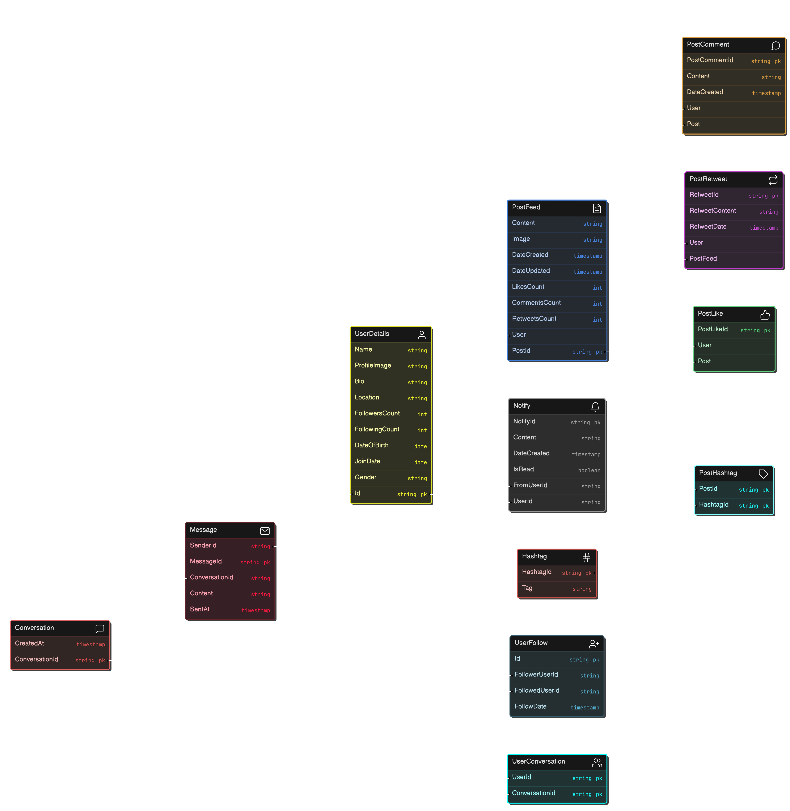

# Blogging app like twitter

## Project Overview

This project is a backend implementation for a social media application. It includes functionalities for user authentication, posting content, liking and commenting on posts, following other users, sending messages, and receiving notifications.

## Table of Contents

- [Project Overview](#project-overview)
- [Table of Contents](#table-of-contents)
- [Class Diagram](#class-diagram)
- [Technologies Used](#technologies-used)
- [Getting Started](#getting-started)
  - [Prerequisites](#prerequisites)
  - [Installation](#installation)
- [Database Models](#database-models)
  - [UserDetails](#userdetails)
  - [PostFeed](#postfeed)
  - [PostLike](#postlike)
  - [PostComment](#postcomment)
  - [PostRetweet](#postretweet)
  - [Hashtag](#hashtag)
  - [PostHashtag](#posthashtag)
  - [Conversation](#conversation)
  - [Message](#message)
  - [UserConversation](#userconversation)
  - [Notify](#notify)
  - [UserFollow](#userfollow)
- [API Endpoints](#api-endpoints)
  - [Auth](#auth)
  - [Chat](#chat)
  - [Notification](#notification)
  - [PostComment](#postcomment)
  - [PostFeed](#postfeed)
  - [PostLike](#postlike)
  - [PostRetweet](#postretweet)
  - [User](#user)
  - [UserFollow](#userfollow)
- [Contributing](#contributing)
- [License](#license)

## Class Diagram



## Technologies Used

- .NET Core
- Entity Framework Core
- ASP.NET Core Identity
- Microsoft SQL Server

## Getting Started

### Prerequisites

- .NET Core SDK
- SQL Server
- NextJs
- Azure

### Installation

1. Clone the repository:
    ```bash
     https://github.com/kaxxsh/Capstone-Project.git
    cd your-repository
    ```

2. Set up the database:
    - Update the connection string in `appsettings.json`.
    - Apply migrations to the database:
        ```bash
        dotnet ef database update
        ```

3. Run the application:
    ```bash
    dotnet run
    ```

## Database Models

### UserDetails

Represents a user in the system.

- **Attributes**:
  - Id
  - Name
  - ProfileImage
  - Bio
  - Location
  - FollowersCount
  - FollowingCount
  - DateOfBirth
  - JoinDate
  - Gender

- **Relationships**:
  - Posts
  - PostLikes
  - PostComments
  - PostRetweets
  - Followers
  - Following
  - Notifies
  - SentNotifies
  - UserConversations

### PostFeed

Represents a post made by a user.

- **Attributes**:
  - PostId
  - Content
  - Image
  - DateCreated
  - DateUpdated
  - LikesCount
  - CommentsCount
  - RetweetsCount

- **Relationships**:
  - User
  - PostLikes
  - PostComments
  - PostRetweets
  - PostHashtags

### PostLike

Represents a like on a post.

- **Attributes**:
  - PostLikeId

- **Relationships**:
  - Post
  - User

### PostComment

Represents a comment on a post.

- **Attributes**:
  - PostCommentId
  - Content
  - DateCreated

- **Relationships**:
  - Post
  - User

### PostRetweet

Represents a retweet of a post.

- **Attributes**:
  - RetweetId
  - RetweetContent
  - RetweetDate

- **Relationships**:
  - PostFeed
  - User

### Hashtag

Represents a hashtag used in posts.

- **Attributes**:
  - HashtagId
  - Tag

- **Relationships**:
  - PostHashtags

### PostHashtag

Represents the relationship between a post and a hashtag.

- **Attributes**:
  - PostId
  - HashtagId

- **Relationships**:
  - Post
  - Hashtag

### Conversation

Represents a conversation between users.

- **Attributes**:
  - ConversationId
  - CreatedAt

- **Relationships**:
  - Messages
  - UserConversations

### Message

Represents a message in a conversation.

- **Attributes**:
  - MessageId
  - ConversationId
  - SenderId
  - Content
  - SentAt

- **Relationships**:
  - Sender
  - Conversation

### UserConversation

Represents the relationship between a user and a conversation.

- **Attributes**:
  - UserId
  - ConversationId

- **Relationships**:
  - User
  - Conversation

### Notify

Represents a notification sent to a user.

- **Attributes**:
  - NotifyId
  - Content
  - DateCreated
  - IsRead
  - FromUserId
  - UserId

- **Relationships**:
  - FromUser
  - User

### UserFollow

Represents a follow relationship between users.

- **Attributes**:
  - Id
  - FollowerUserId
  - FollowedUserId
  - FollowDate

- **Relationships**:
  - FollowerUser
  - FollowedUser

## API Endpoints

### Auth

- `POST /api/Auth/login`
- `POST /api/Auth/register`

### Chat

- `POST /api/Chat/create-conversation`
- `POST /api/Chat/send`
- `GET /api/Chat/messages`
- `GET /api/Chat/conversationsByUserId`
- `GET /api/Chat/conversation`

### Notification

- `POST /api/Notification`
- `GET /api/Notification/{id}`
- `PUT /api/Notification/{id}`
- `DELETE /api/Notification/{id}`
- `GET /api/Notification/user/{userId}`

### PostComment

- `POST /api/PostComment`
- `PUT /api/PostComment/{PostCommentId}`
- `DELETE /api/PostComment/{PostCommentId}`
- `GET /api/PostComment/comment/{PostCommentId}`
- `GET /api/PostComment/post/{PostId}`

### PostFeed

- `GET /api/PostFeed`
- `POST /api/PostFeed`
- `GET /api/PostFeed/{postId}`
- `PUT /api/PostFeed/{postId}`
- `DELETE /api/PostFeed/{postId}`
- `GET /api/PostFeed/GetPostByUser{UserID}`
- `GET /api/PostFeed/hashtag/{tag}`

### PostLike

- `GET /api/PostLike/{postId}`
- `POST /api/PostLike/{postId}`

### PostRetweet

- `POST /api/PostRetweet`
- `DELETE /api/PostRetweet/{postRetweetId}`
- `GET /api/PostRetweet/{postRetweetId}`
- `GET /api/PostRetweet/post/{postId}`
- `GET /api/PostRetweet/user/{userId}`

### User

- `GET /api/User`
- `PUT /api/User`
- `DELETE /api/User`
- `GET /api/User/UserId`
- `GET /api/User/Name`
- `GET /api/User/UserName`

### UserFollow

- `POST /api/UserFollow/follow/{followerName}`
- `POST /api/UserFollow/unfollow/{followerName}`
- `GET /api/UserFollow/followers/{followerName}`
- `GET /api/UserFollow/following/{followingName}`
- `GET /api/UserFollow/isfollowing/{followerName}`

